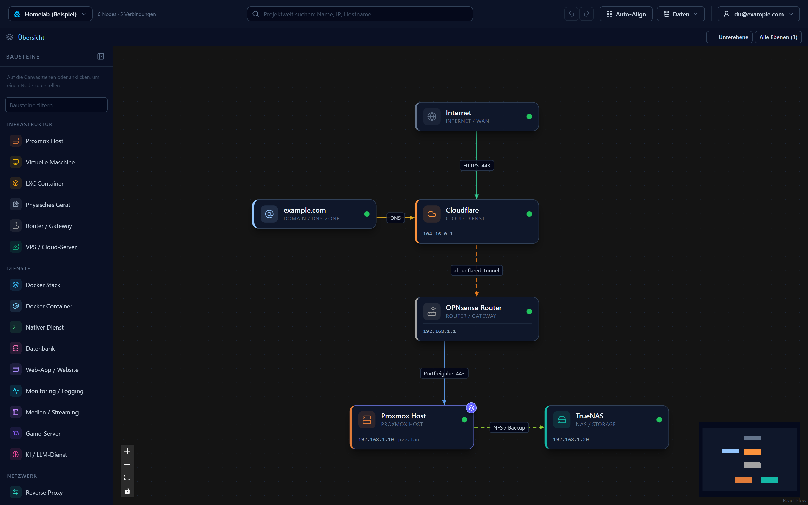
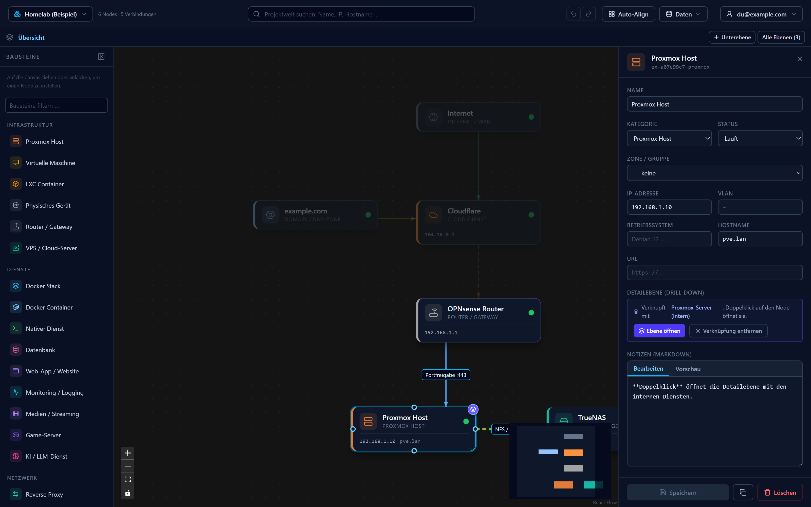

# 🕸️ Lab Visualizer

Ein selbst gehostetes **Infrastructure Documentation Tool**: Systeme, Dienste und ihre
Abhängigkeiten visuell pflegen — vom Homelab über Cloud-Setups bis zu Software- und
Prozesslandschaften. Mit interaktiver Canvas (React Flow), Deep-Dive-Panel
(typisierte Felder + Markdown-Notizen) und einer sauberen REST-API für Automatisierung.




> Die Übersichtsebene des Beispielprojekts, das jedes neue Konto mitbringt:
> *Internet → Cloudflare → Router → Proxmox → NAS*. Der Stapel-Marker am
> Proxmox-Host zeigt an, dass sich per Doppelklick eine Detailebene öffnet.

<details>
<summary><b>Deep-Dive-Panel ansehen</b> — typisierte Felder, Markdown-Notizen, Fokus-Modus</summary>



Ein Klick auf einen Node hebt ihn samt Nachbarn hervor, dimmt den Rest und öffnet
rechts den Drawer: typisierte Felder nach Themengruppen (Allgemein, Netzwerk,
System, Betrieb), die Verknüpfung zur Detailebene und Markdown-Notizen mit
Live-Vorschau.

</details>

## Features

- **Accounts & Mehrbenutzer** — Registrierung und Login per E-Mail/Passwort. Jede Person
  sieht und bearbeitet **nur ihre eigenen Projekte** — vollständig voneinander isoliert.
  Passwörter werden mit scrypt gehasht, Sessions laufen über HttpOnly-Cookies (server-seitig
  in SQLite, sofort widerrufbar). Kontoverwaltung direkt in der App: **Passwort ändern**
  (beendet alle anderen Sitzungen) und **Konto löschen** (entfernt alle Daten).
  Siehe [Sicherheit](#sicherheit).
- **Kostenlos & quelloffen** — keine Bezahlfunktionen, kein Abo, kein Konto-Upgrade.
  Beim Self-Hosting gibt es **keine Obergrenzen**. Wer die App öffentlich für Fremde
  betreibt, kann pro Instanz Grenzen setzen — siehe [Instanz-Limits](#instanz-limits).
- **Projekte mit Startvorlage** — komplett getrennte Arbeitsbereiche (z. B. „Homelab”,
  „Arbeit”). Beim Anlegen wählst du eine **Vorlage**: Homelab, Netzwerkplan, Cloud-Umgebung,
  Kubernetes-Cluster, Software-Architektur, Prozess & Organisation — oder leer. Die Vorlage
  bringt einen fertigen Beispielinhalt mit und setzt die passenden Bausteine.
- **Bausteine (Domain-Packs)** — jedes Projekt sieht nur die Kategorien, Felder und
  Verbindungsarten seiner Domäne. Ein Prozess-Projekt bekommt Prozessschritt, Rolle und
  Kostenstelle statt Hypervisor, VLAN und IP-Adresse; ein Cluster-Projekt Namespace, Image
  und Replicas. Jederzeit umschaltbar, ohne Datenverlust: Werte zu abgewählten Bausteinen
  bleiben am Node erhalten.
- **Globale Suche** — durchsucht alle Ebenen des aktiven Projekts; ein Klick auf einen Treffer
  springt in die richtige Ebene und selektiert den Node.
- **Undo / Redo** — für alle Canvas-Änderungen (Node/Verbindung anlegen, löschen, verschieben,
  bearbeiten, Kantenverlauf) inkl. Tastenkürzel (Strg/Cmd+Z, Umschalt für Wiederholen).
- **Ebenen (Drill-down-Hierarchie)** — Infrastruktur in Abstraktionsebenen gliedern statt alles
  auf eine Fläche zu quetschen. Ein Node der Übersicht (z. B. „Mein Server“) verlinkt in eine
  eigene **Detailebene** mit seinem internen Routing; **Doppelklick** zoomt hinein (wie im
  C4-Modell). Navigation per **Breadcrumb** und Ebenen-Baum. Jede Ebene ist eine eigene,
  fokussierte Canvas — Kanten verbinden nur Nodes derselben Ebene.
- **Visueller Editor** — Nodes (Hosts, VMs, Container, Dienste, Cloud-Komponenten, aber
  auch Fachsysteme oder Prozessschritte) frei auf der Canvas platzieren, per Drag & Drop aus
  der Palette erstellen und mit Verbindungen (Edges) verknüpfen. Zonen/Gruppen fassen Nodes
  zusammen und bewegen ihre Kinder mit. Ausrichtungshilfen (Snap-Lines) beim Verschieben.
- **Kanten-Routing wie in bpmn.io** — Verbindungen docken automatisch an der besten
  Node-Seite an und weichen Hindernissen aus. Linien lassen sich direkt greifen und
  orthogonal verlegen: Doppelklick auf die Linie fügt Eckpunkte ein (Doppelklick auf einen
  Eckpunkt entfernt ihn), das Docking wird beim Verschieben von Nodes automatisch repariert.
  Beschriftungen sitzen immer **auf** der Linie und werden per Drag entlang des Pfads verschoben.
- **Übersichtlich auch bei 50+ vernetzten Nodes** — **Fokus-Modus**: Hover oder Klick auf einen
  Node hebt ihn samt Nachbarn und verbindenden Kanten hervor und dimmt den Rest, sodass sich
  Zusammenhänge sofort ablesen lassen. **Semantisches Zoomen** blendet Kanten-Labels in der
  Gesamtübersicht aus und beim Hineinzoomen wieder ein. Rendering bleibt flüssig (60 fps beim
  Verschieben), da Kanten nur bei Bewegung ihrer eigenen Endknoten neu berechnet werden.
- **Deep-Dive Panel** — Klick auf Node oder Verbindung öffnet den Drawer: **typisierte
  Felder** aus dem Katalog, nach Themengruppen sortiert (Netzwerk, System, Betrieb, …).
  Gruppen ohne Werte bleiben eingeklappt, sodass ein Setup ohne Netzwerkbezug auch kein
  Netzwerkformular sieht. Dazu **Markdown-Notizen** mit Live-Vorschau (GFM-Tabellen,
  Listen, Code) und ein **Key-Value-System (Custom Fields)** für alles Übrige.
- **API-First** — jede UI-Aktion läuft über die REST-API; alles lässt sich skripten.
- **KI-Agenten:** vollständige API-Doku in [AGENTS.md](AGENTS.md)
- **Suche** — filtert live über den Namen und **alle Feldwerte** (typisierte Felder wie
  Custom Fields, unabhängig davon, welche Bausteine das Projekt nutzt); die globale
  Suche springt in die richtige Ebene und **zentriert den Treffer**.
- **Filter** — nach Status, Kategorie und jedem Auswahlfeld des Projekts (z. B.
  Umgebung = Produktion, Kritikalität = Kritisch). Die Auswahlwerte kommen aus dem
  Katalog, ein Prozess-Projekt filtert also nach anderen Feldern als ein Cluster-Projekt.
  Mehrere Filter gelten gleichzeitig. Nicht passende Nodes werden **gedimmt statt
  ausgeblendet**, damit sichtbar bleibt, woran sie hängen. Gilt auch in der Leseansicht
  eines Freigabelinks.
- **Farben & Symbole überall** — Nodes und **Zonen** lassen sich einzeln einfärben
  (DMZ rot, intern grün) statt nur über ihre Kategorie; Projekte und Ebenen tragen
  ebenfalls Symbol und Farbe und zeigen sie in Kopfzeile und Breadcrumb.
- **Eigene Icons & Bilder** — jedem Node lässt sich statt des Kategorie-Symbols ein
  **eigenes Bild** geben (PNG, JPEG, WebP, SVG): echte Produktlogos machen ein Diagramm
  auf einen Blick lesbar. Bilder lassen sich ebenso in **Notizen** einfügen. Sie liegen
  in der Datenbank dieser Instanz, werden **nie von außen nachgeladen** und reisen im
  Projekt-Export mit, sodass eine geteilte Kopie ihre Icons behält.
- **Diagramm als Bild** — die aktuelle Ebene als **PNG** (doppelte Auflösung) oder
  **SVG** speichern, für Wiki, Ticket oder Folie. Aufgenommen wird immer der *ganze*
  Graph, unabhängig vom aktuellen Zoom; Auswahl, Fokus-Modus und Suchhervorhebung
  bleiben draußen. Läuft komplett im Browser.
- **Read-only-Freigabelink** — ein Projekt per Link teilen, **ohne Konto** beim
  Gegenüber: `…/s/<token>` zeigt dieselbe Canvas mit allen Ebenen, Notizen und
  Bildern, aber gesperrt — kein Anlegen, kein Ändern, kein Löschen. Links tragen
  eine Beschreibung, laufen optional ab und sind jederzeit widerrufbar. Gespeichert
  wird nur der Hash des Tokens; der Link selbst ist nach dem Anlegen nicht mehr
  abrufbar.
- **Export / Import & Projekte teilen** — kompletter Graph als JSON-Backup, einzelne
  Projekte separat exportieren und bei einem anderen Konto **als neues Projekt
  hinzufügen** (Merge-Import, kollisionsfrei mit neuen IDs) — ideal für Teams.
- **Produktiv arbeiten** — Duplizieren (Strg+D), Undo/Redo (Strg+Z / Strg+Y),
  Löschen (Entf/Backspace), Kantenrichtung umkehren, Ebenen umbenennen; zuletzt
  geöffnetes Projekt und Ebene werden pro Konto gemerkt.
- **Offline-fähig** — keine externen CDNs/Fonts; läuft komplett lokal auf dem eigenen Host.

## Schnellstart

```bash
docker compose up -d --build
```

→ Web-UI: **http://localhost:8080** · API (über Frontend-Proxy): **http://localhost:8080/api**

Versionierte Images (GHCR), unabhängig für Backend und Frontend:

```bash
export BACKEND_VERSION=1.0.0    # oder: $(tr -d '[:space:]' < backend/VERSION)
export FRONTEND_VERSION=1.0.0   # oder: $(tr -d '[:space:]' < frontend/VERSION)
docker compose pull
docker compose up -d
```

Beim ersten Aufruf **registrierst du ein Konto** (E-Mail + Passwort). Jeder **neu
registrierte Nutzer** erhält automatisch ein Best-Practice-Beispielprojekt
**„Homelab (Beispiel)"**: eine dreistufige Drill-down-Infrastruktur (Übersicht
*Internet → Cloudflare → Router → Proxmox → NAS*, Detailebene *Proxmox intern* mit
Reverse-Proxy/SSO/DB, Detailebene *nginx Routing*) — so ist sofort ein sinnvolles
Beispiel zum Erkunden da statt einer leeren Canvas. Für alles andere gibt es beim
Anlegen eines Projekts weitere Vorlagen (Netzwerk, Cloud, Kubernetes, Software,
Prozesse) — siehe [Architektur](#architektur).

> ⚠️ **HTTPS in Produktion:** Läuft die Instanz öffentlich (z. B. hinter einem
> Cloudflare-Tunnel), unbedingt über **HTTPS** ausliefern und `COOKIE_SECURE=true`
> setzen, damit Session-Cookies nur verschlüsselt übertragen werden.

Die SQLite-Datenbank liegt in `./data/labviz.db` — **Backup = Datei/Ordner kopieren**
(dank WAL-Modus am besten den ganzen `data/`-Ordner oder via
`sqlite3 data/labviz.db ".backup backup.db"`).

### Entwicklung (ohne Docker)

```bash
# Backend (Port 3000)
cd backend && npm install && npm run dev

# Frontend (Port 5173, proxied /api → :3000)
cd frontend && npm install && npm run dev

# Tests
cd backend && npm test
```

## Architektur

```
┌───────────────┐     /api (Proxy)      ┌────────────────┐        ┌─────────────┐
│   Frontend    │ ────────────────────▶ │    Backend     │ ─────▶ │   SQLite    │
│ React + Vite  │                       │ Express (Node) │        │ ./data/*.db │
│ React Flow    │                       │ REST-API + Zod │        └─────────────┘
│ nginx (:8080) │                       │     (:3000)    │
└───────────────┘                       └────────────────┘
```

- **Frontend:** React 18 + TypeScript, [React Flow](https://reactflow.dev) (Canvas),
  Zustand (State), Tailwind CSS 4, react-markdown (GFM). Ausgeliefert über nginx,
  das `/api` an das Backend weiterreicht.
- **Backend:** Node.js 22 + Express, better-sqlite3 (synchron, schnell, eine Datei),
  Zod-Validierung. Kein ORM — das Schema ist bewusst klein.
- **Datenmodell:** Kern-Felder + `fields` (typisiert) + `customFields` (frei) pro Node.
  Kategorien, Status, Verbindungsarten **und Felddefinitionen** kommen aus einem Katalog
  (`backend/src/catalog/`). Ein neues Feld ist ein Eintrag dort — keine DB-Migration, keine
  UI-Änderung: Panel, Canvas-Anzeige, Suche und Validierung bauen sich daraus.
- **Domain-Packs:** Der Katalog ist in thematische Pakete geteilt (`backend/src/catalog/packs/`):
  Infrastruktur, Netzwerk, Security, Betrieb, Cloud, Kubernetes, Software-Architektur,
  Prozesse & Organisation, Homelab-Extras. Ein Kern-Pack (Anwendung, Datenbank, Gruppe,
  Nutzer, Abhängigkeit, Datenfluss …) ist immer aktiv. Jedes Projekt wählt seine Packs;
  `/api/projects/:id/catalog` liefert genau deren Bausteine, `/api/meta/catalog` alles.
  Ein neues Pack = eine Datei + ein Registry-Eintrag.
- **Vorlagen:** `backend/src/templates/` — jede Vorlage nennt ihre Packs und baut ihren
  Startinhalt über die normale Store-API auf. Ein Test prüft, dass keine Vorlage etwas
  verwendet, das ihr Projekt gar nicht sieht.
- **Produktneutral:** Der Katalog beschreibt Bausteine (Hypervisor, Container, Datenbank,
  Reverse Proxy), keine Hersteller. „Proxmox VE“, „AWS“ oder „Kubernetes“ sind **Werte** im
  Feld `platform` — derselbe Node-Typ trägt damit auch ESXi, Hyper-V oder XCP-ng. Die
  Verbindungsarten decken neben Protokollen (HTTP, SSH, VPN) auch technikfreie Beziehungen
  ab (Abhängigkeit, Datenfluss, Steuerung), sodass sich Architektur- und Prozessdiagramme
  genauso abbilden lassen.
- **Eigene Kategorien:** Die API akzeptiert beliebige Kategorie-Strings, und im
  Drawer gibt es „Eigene Kategorie …“ — unbekannte Kategorien werden mit
  Fallback-Icon/-Farbe gerendert. Nichts ist auf den Katalog beschränkt.

## REST-API

Alle Endpunkte liefern/erwarten JSON. Basis-URL im Compose-Setup:
`http://localhost:8080/api` (oder Backend direkt auf `:3000`, wenn freigegeben).

**Authentifizierung:** Bis auf `/api/health`, `/api/meta/catalog` und `/api/auth/*`
erfordern **alle** Endpunkte eine Anmeldung (Session-Cookie `sid`). Ohne gültige Session
antwortet die API mit `401`. Alle Daten-Endpunkte sind **auf den angemeldeten Nutzer
beschränkt** — fremde IDs verhalten sich wie „nicht vorhanden" (`404`).

| Methode | Pfad | Beschreibung |
|---|---|---|
| `POST` | `/api/auth/register` | Konto anlegen (`{email, password}`), seedet ein Beispielprojekt, setzt Cookie |
| `POST` | `/api/auth/login` | Anmelden (`{email, password}`), setzt Session-Cookie |
| `POST` | `/api/auth/logout` | Session serverseitig beenden |
| `GET` | `/api/auth/me` | Aktueller Nutzer inkl. Instanz-Limits (`401`, wenn nicht angemeldet) |
| `POST` | `/api/auth/password` | Passwort ändern (`{currentPassword, newPassword}`), beendet andere Sessions |
| `DELETE` | `/api/auth/account` | Konto + alle Daten löschen (`{password}`) |
| `GET` | `/api/health` | Healthcheck (öffentlich) |
| `GET` | `/api/meta/catalog` | Kategorien, Status, Verbindungsarten, Linienstile (öffentlich) |
| `GET` | `/api/meta/legal` | Rechtstexte dieser Instanz als Markdown (öffentlich) |
| `GET` | `/api/graph` | Kompletter Graph (`{nodes, edges}`) |
| `GET` | `/api/graph/export?projectId=` | JSON-Dump (alles oder nur ein Projekt) |
| `POST` | `/api/graph/import` | Graph ersetzen (`mode:"replace"`) oder additiv anfügen (`mode:"merge"`) |
| `GET` | `/api/nodes?q=&category=&status=` | Nodes suchen/filtern |
| `POST` | `/api/nodes` | Node anlegen (optional mit eigener `id`) |
| `GET/PATCH/PUT/DELETE` | `/api/nodes/:id` | Node lesen / ändern / löschen |
| `POST` | `/api/nodes/positions` | Bulk-Positionsupdate (`{positions:[{id,x,y,width?,height?}]}`) |
| `GET` | `/api/edges?nodeId=&viewId=&projectId=` | Verbindungen (Filter wie bei `/nodes`) |
| `GET`/`POST` | `/api/projects/:id/shares` | Freigabelinks auflisten / anlegen |
| `DELETE` | `/api/projects/:id/shares/:shareId` | Link widerrufen |
| `GET` | `/api/share/:token` | **Ohne Anmeldung:** Lesestand eines Projekts |
| `GET`/`POST` | `/api/assets` | Bildbibliothek auflisten / hochladen |
| `GET`/`DELETE` | `/api/assets/:id` | Bild ausliefern / löschen |
| `POST` | `/api/edges` | Verbindung anlegen (`{sourceId, targetId, …}`) |
| `GET/PATCH/PUT/DELETE` | `/api/edges/:id` | Verbindung lesen / ändern / löschen |

### Beispiele

```bash
# Zuerst anmelden und das Session-Cookie in einem Cookie-Jar ablegen …
curl -c cookies.txt -X POST http://localhost:8080/api/auth/login \
  -H 'Content-Type: application/json' \
  -d '{ "email": "du@example.com", "password": "dein-passwort" }'
# … dann das Cookie bei jedem weiteren Request mitschicken (-b cookies.txt).

# Node per Skript anlegen (mit sprechender ID für spätere Updates)
curl -b cookies.txt -X POST http://localhost:8080/api/nodes \
  -H 'Content-Type: application/json' \
  -d '{
    "id": "nginx",
    "name": "nginx Reverse Proxy",
    "category": "reverse-proxy",
    "status": "active",
    "fields": { "ip": "192.168.2.104", "platform": "Debian 12", "ram": "4" },
    "customFields": { "Container-ID": "118", "Stack": "nginx:alpine + CrowdSec" }
  }'

# Status aus einem Monitoring-Skript heraus aktualisieren
curl -b cookies.txt -X PATCH http://localhost:8080/api/nodes/nginx \
  -H 'Content-Type: application/json' \
  -d '{ "status": "error" }'

# Verbindung anlegen
curl -b cookies.txt -X POST http://localhost:8080/api/edges \
  -H 'Content-Type: application/json' \
  -d '{ "sourceId": "cloudflared", "targetId": "nginx", "kind": "http", "label": "HTTP :80" }'

# Backup per API (nur die eigenen Daten)
curl -s -b cookies.txt http://localhost:8080/api/graph/export > backup.json
```

**Katalog & Vorlagen:** `GET /meta/catalog` liefert den **vollständigen** Katalog über alle
Packs (Referenz für Skripte), `GET /projects/:id/catalog` den eines Projekts.
`GET /meta/packs` und `GET /meta/templates` listen die Auswahl. Ein Projekt anlegen mit
Vorlage: `POST /projects { "name": "…", "template": "kubernetes" }` — die Packs kommen
dann von der Vorlage, `packs` überschreibt sie.

**Projekt-Felder:** `name` (Pflicht), `color`, `icon`, `packs` (Domain-Packs),
`sortOrder`. Beim Anlegen zusätzlich `template`.

**Node-Felder:** `name` (Pflicht), `category`, `status`
(`active|inactive|planned|maintenance|error|unknown`), `parentId` (Zone/Gruppe),
`position{x,y}`, `width/height` (Zonen), `icon` (Symbolname oder `asset:<id>`;
`null` = Kategorie-Symbol), `color` (`null` = Kategorie-Farbe),
`notes` (Markdown), `fields` (String→String,
Schlüssel und Typen aus `/api/meta/catalog`), `customFields` (String→String, frei).
**Edge-Felder:** `sourceId`, `targetId` (Pflicht), `label`, `kind`, `lineStyle`
(`solid|dashed|dotted`), `animated`, `notes`, `customFields`.

**Positionen:** Kind-Nodes einer Zone speichern ihre Position **relativ zum Parent**
(React-Flow-Konvention). Beim Löschen einer Zone werden Kinder automatisch an den
Großeltern-Knoten übergeben, ohne optisch zu springen.

## Produktion (hinter Cloudflare)

Der öffentliche Zugriff läuft über **HTTPS via Cloudflare** (Tunnel → nginx → Backend).
Damit das sauber und sicher funktioniert:

- **Secure-Cookies** sind dank `NODE_ENV=production` (im Backend-Image) automatisch aktiv —
  Session-Cookies werden nur über HTTPS übertragen. (Override: `COOKIE_SECURE`.)
- **Sicherheits-Header** liefert nginx mit: `Content-Security-Policy` (nur same-origin, keine
  externen Quellen), `Strict-Transport-Security` (HSTS), `X-Frame-Options: DENY`,
  `X-Content-Type-Options: nosniff`, `Referrer-Policy`, `Permissions-Policy`.
- **Echte Client-IP:** nginx reicht `CF-Connecting-IP` durch; das Rate-Limit greift damit
  pro echtem Client statt pro Cloudflare-Edge.
- **CSRF/CORS:** `SameSite=Lax` + Origin-Prüfung; CORS ist aus (same-origin über den Proxy).
- **Startreihenfolge:** Das Frontend startet erst, wenn das Backend laut Healthcheck bereit ist.
- **Konfiguration:** Werte über eine `.env` setzen (Vorlage: [`.env.example`](.env.example)).
  Die Datei wird **nicht** eingecheckt und nicht mit deployt.

Empfohlen zusätzlich **in Cloudflare**: „Always Use HTTPS", HSTS aktivieren, und die
Origin nur über den Tunnel erreichbar halten (kein offener Direktzugriff auf Port 8080/3000),
damit `CF-Connecting-IP` vertrauenswürdig bleibt.

> Läufst du die Prod-Images ausnahmsweise lokal über `http://localhost:8080`, setze
> `COOKIE_SECURE=false`, sonst sendet der Browser das Session-Cookie nicht.

## Instanz-Limits

Lab Visualizer ist vollständig kostenlos — es gibt nichts zu kaufen und keine
Funktion, die hinter einer Schranke liegt. **Standardmäßig gilt kein einziges Limit.**

Wer die App allerdings öffentlich für Fremde betreibt, will nicht, dass ein einzelnes
Konto das Volume füllt. Dafür lassen sich pro Instanz Obergrenzen setzen (leer oder
`unlimited` = kein Limit):

| Variable | Wirkung |
|---|---|
| `MAX_PROJECTS_PER_USER` | Projekte pro Konto |
| `MAX_VIEWS_PER_PROJECT` | Ebenen pro Projekt |
| `MAX_NODES_PER_PROJECT` | Nodes pro Projekt (über alle Ebenen) |
| `RATE_LIMIT_WRITES_PER_MIN` | Schreib-Requests pro Minute und IP (Default `600`, `0` = aus) |
| `MAX_BODY` / `MAX_IMPORT_BODY` | Größe eines Request-Bodys (Default `2mb`, für den Import `20mb`) |

- **Enforcement:** serverseitig in `backend/src/limits.js` + `store.js` — auch der
  Import wird geprüft, bevor etwas geschrieben wird. Beim Erreichen einer Grenze
  antwortet die API mit **`403` und `code: "limit_reached"`**; die UI zeigt einen
  Hinweis mit Verweis aufs Self-Hosting (`frontend/src/components/ui/LimitDialog.tsx`).
- **Startprüfung:** Jedes neue Konto bekommt ein Beispielprojekt (1 Projekt, 3 Ebenen,
  18 Nodes). Sind die Limits kleiner, bricht das Backend **beim Start** mit einer
  klaren Meldung ab — statt später jede Registrierung mit `403` scheitern zu lassen.
- **Betrieb einer öffentlichen Instanz:** Bedenke zusätzlich, dass du damit
  personenbezogene Daten Dritter verarbeitest (Konten) und dass Nutzer sensible
  Infrastruktur-Notizen ablegen. Sorge für Backups, HTTPS und — je nach Rechtsraum —
  Rechtstexte (siehe unten).

## Rechtstexte (Impressum & Datenschutz)

Wer Lab Visualizer öffentlich anbietet, braucht je nach Rechtsraum eigene
Rechtstexte. Sie sind deshalb **nicht** Teil des Quelltextes — sonst würde jeder
Fork die Anschrift eines Fremden ausliefern. Stattdessen legt jede Instanz ihre
eigenen Dateien im Datenverzeichnis ab:

```
data/legal/impressum.md
data/legal/datenschutz.md
```

`data/` ist bereits das persistente Docker-Volume und liegt außerhalb der
Versionsverwaltung. Ausfüllbare Vorlagen mit Hinweisen stehen in
[`docs/legal/`](docs/legal); die Dateien werden als Markdown gerendert.

Vorhandene Texte verlinkt die Oberfläche automatisch — auf dem Anmeldebildschirm
(also **ohne Konto erreichbar**, wie es das Impressum verlangt) und im Konto-Menü.
Fehlt eine Datei, erscheint kein Link; beim Self-Hosting im eigenen Netz braucht
es sie in der Regel nicht. Abrufbar sind sie auch über `GET /api/meta/legal`.

> Die Vorlagen sind nach bestem Wissen erstellt und beschreiben die Verarbeitung,
> die diese Software tatsächlich vornimmt — sie sind aber **keine Rechtsberatung**.
> Prüfe sie, bevor du eine Instanz öffentlich stellst.

## Sicherheit

- **Passwörter** werden mit **scrypt** (memory-hard, `node:crypto`) und pro-Nutzer-Salt
  gehasht; Verifikation in konstanter Zeit. Keine externen Krypto-Abhängigkeiten.
- **Sessions** liegen serverseitig in SQLite; das Cookie enthält nur ein 256-bit-Zufalls­
  token, in der DB steht ausschließlich dessen SHA-256-Hash. Cookie-Flags: `HttpOnly`,
  `SameSite=Lax`, `Secure` (bei HTTPS). Logout beendet die Session serverseitig sofort.
- **Datenisolation:** Jedes Projekt gehört einem Nutzer; Ebenen/Nodes/Kanten erben den
  Besitz. Jeder Zugriff wird geprüft — fremde IDs liefern `404`.
- **CSRF:** Bei zustandsändernden Requests wird der `Origin`-Header gegen den Host geprüft.
- **Brute-Force:** Login/Registrierung sind pro IP rate-limitiert; Login-Fehler sind
  generisch (keine Nutzer-Enumeration). Schreibende API-Requests sind zusätzlich pro
  IP gedrosselt (`RATE_LIMIT_WRITES_PER_MIN`, Default 600/min).
- **CORS** ist standardmäßig aus (Frontend & API sind same-origin über den Proxy); nur bei
  gesetztem `CORS_ORIGIN` wird ein Cross-Origin mit Credentials erlaubt.

## Konfiguration

| Variable | Default | Beschreibung |
|---|---|---|
| `PORT` | `3000` | Backend-Port |
| `DATA_DIR` | `./data` (`/data` im Container) | Ablageort der SQLite-DB |
| `DB_FILE` | `$DATA_DIR/labviz.db` | Expliziter DB-Pfad |
| `NODE_ENV` | `production` (im Image) | In Produktion sind Secure-Cookies automatisch aktiv. |
| `COOKIE_SECURE` | _auto_ | `true`/`false` erzwingt das Secure-Flag. Default: in Produktion `true`, lokal (http) automatisch aus. |
| `SESSION_TTL_DAYS` | `30` | Gültigkeitsdauer einer Session (mit Sliding-Renewal) |
| `ALLOW_REGISTRATION` | `true` | Auf `false` sperrt die Selbst-Registrierung |
| `CORS_ORIGIN` | _(leer)_ | Kommagetrennte Origin(s) für Cross-Origin-Zugriff mit Credentials |
| `MAX_PROJECTS_PER_USER` | _(unbegrenzt)_ | Obergrenze Projekte pro Konto — siehe [Instanz-Limits](#instanz-limits) |
| `MAX_VIEWS_PER_PROJECT` | _(unbegrenzt)_ | Obergrenze Ebenen pro Projekt |
| `MAX_NODES_PER_PROJECT` | _(unbegrenzt)_ | Obergrenze Nodes pro Projekt |
| `RATE_LIMIT_WRITES_PER_MIN` | `600` | Schreib-Requests pro Minute und IP (`0` = aus) |
| `MAX_BODY` | `2mb` | Größter Request-Body außerhalb des Imports |
| `MAX_IMPORT_BODY` | `20mb` | Größter Body für `POST /api/graph/import` |
| `LEGAL_DIR` | `$DATA_DIR/legal` | Verzeichnis mit `impressum.md` / `datenschutz.md` |

## Projektstruktur

```
├── docker-compose.yml
├── docs/                     # Screenshots und Rechtstext-Vorlagen
├── backend/
│   ├── VERSION               # Backend-SemVer → GHCR-Tag / backend-v*
│   ├── CHANGELOG.md
│   ├── src/
│   │   ├── server.js         # Bootstrap
│   │   ├── app.js            # Express-App, Auth-Middleware, Fehler-Handling
│   │   ├── auth.js           # Passwort-Hashing (scrypt), Sessions, requireAuth, CSRF, Rate-Limit
│   │   ├── db.js             # SQLite-Schema (users, sessions, projects.user_id …)
│   │   ├── store.js          # CRUD, Import/Export, Row-Level-Autorisierung
│   │   ├── seed.js           # Beispielprojekt je Nutzer (bei Registrierung)
│   │   ├── limits.js         # Optionale Instanz-Limits (Standard: unbegrenzt)
│   │   ├── legal.js          # Rechtstexte je Instanz (aus $DATA_DIR/legal)
│   │   ├── validation.js     # Zod-Schemas (inkl. register/login)
│   │   ├── assets.js         # Bild-Uploads: MIME-Sniffing, Auslieferungs-Header
│   │   ├── share.js          # Freigabe-Tokens (Hash speichern, Ablauf prüfen)
│   │   ├── layout.js         # Auto-Align (hierarchisches Layout)
│   │   ├── catalog/          # Kern + Domain-Packs (Kategorien, Felder, Edge-Arten)
│   │   ├── templates/        # Projektvorlagen (index.js Registry, apply.js Anwendung)
│   │   └── routes/           # auth, projects, views, nodes, edges, graph, meta, assets, share
│   └── test/                 # API, Auth & Isolation, Layout, Paketgrenzen (node --test)
└── frontend/
    ├── VERSION               # Frontend-SemVer → GHCR-Tag / frontend-v*
    ├── CHANGELOG.md
    └── src/
        ├── store/graph.ts    # Zustand-Store (Canvas ⇄ API), Filter, Leseansicht
        ├── store/auth.ts     # Auth-Zustand (Login/Registrierung/Session)
        ├── components/auth   # AuthScreen (Login/Registrieren)
        ├── components/canvas # Nodes, Zonen, Edges, Canvas
        ├── components/panel  # Drawer, Formulare, Markdown, Custom Fields
        ├── components/share  # Leseansicht eines Freigabelinks (ohne Konto)
        ├── lib/catalog.ts    # Katalogzugriff: Icons/Farben, Felder, Filter, Suche
        ├── lib/icons.tsx     # Kategorie-Symbole und eigene Bilder (asset:<id>)
        └── lib/diagramImage.ts # Ebene als PNG/SVG (im Browser)
```

## Mitmachen

Issues und Pull Requests sind willkommen — Details in
[CONTRIBUTING.md](CONTRIBUTING.md). Vor einem PR bitte durchlaufen lassen, was
auch die CI prüft:

```bash
cd backend && npm test
```

```bash
cd frontend && npm test && npm run build
```

Sicherheitslücken bitte **nicht** als öffentliches Issue melden, sondern über den
Weg in [SECURITY.md](SECURITY.md).

## Lizenz

[MIT](LICENSE) — nutze, ändere und betreibe das Projekt frei, gewerblich wie privat.
Einzige Bedingung ist der Erhalt des Copyright-Hinweises.
